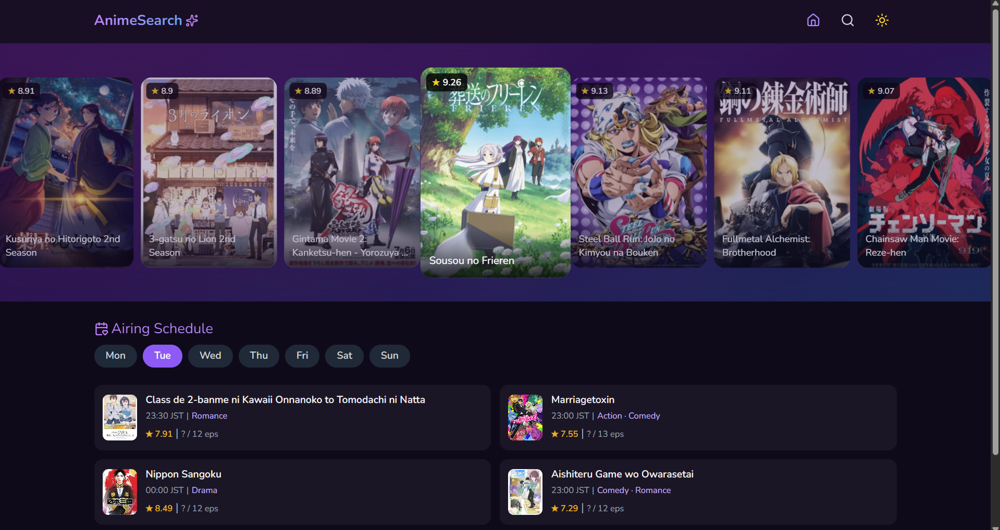

# Anime Search App 🎌

A simple anime search web app built with React + TypeScript using Jikan API.

## 🚀 Features
- Search anime by title
- Pagination (desktop & mobile)
- Anime detail page
- Trailer modal
- Dark mode support
- Responsive UI

## 🛠 Tech Stack
- React + TypeScript
- Vite
- Tailwind CSS
- Axios
- React Router
- Zustand (state management)

## 📡 API
Powered by Jikan API (MyAnimeList unofficial API)

## 🖼 Preview


## 🌐 Live Demo
https://tinyurl.com/anime-search

## 📦 Installation

```bash
git clone https://github.com/your-username/anime-search.git
cd anime-search
npm install
npm run dev